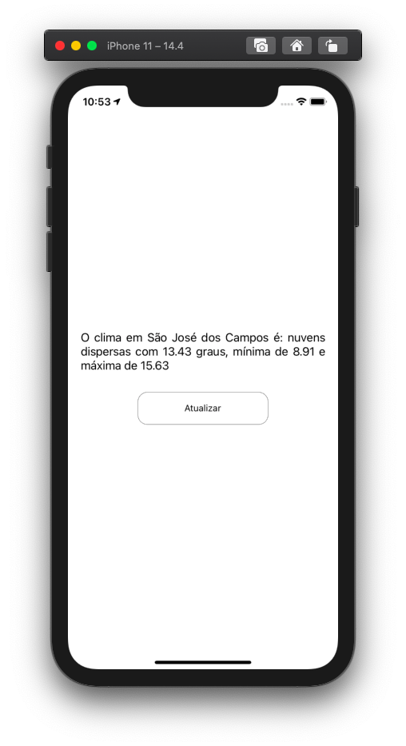

# React-Native-Weather-API
 

## How to run
- Copy `sample.env` and rename to `.env`
- Get your api key in https://openweathermap.org/api
- Set the API_KEY in `.env` 
- Install dependencies: `yarn install`
- Install pods `npx pod-install` (only ios)
- run `yarn ios` for run in ios and `yarn android` for run in android